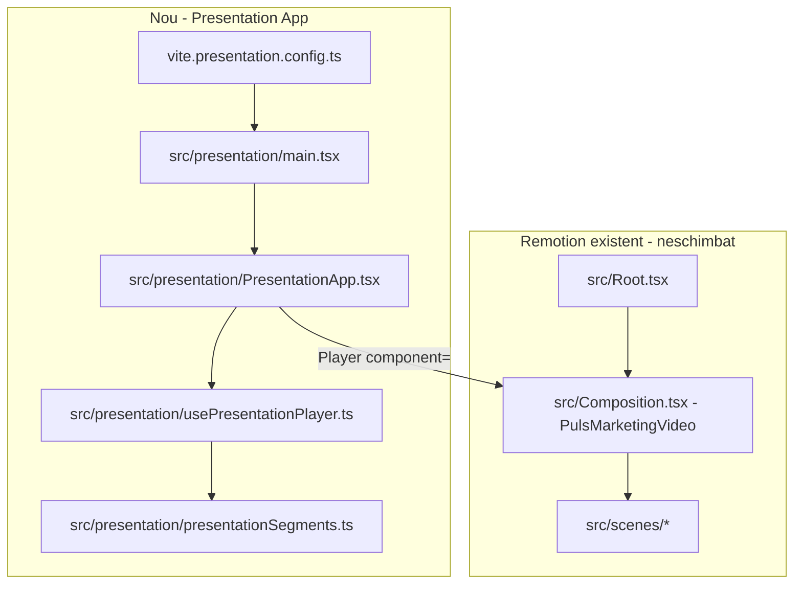

# Plan: Mod prezentare interactiv (`npm run presentation`)

## Obiectiv

Aplicație web care:

1. **Pornește automat animația primei scene** la load
2. **Se oprește** când animația scenei curente e gata
3. La **Next** → rulează animația scenei următoare (inclusiv tranziția) și rămâne pe ecran
4. La **Previous** → revine la frame-ul final al scenei anterioare (fără re-animare)

Remotion Studio (`npm run dev`) și render-ul video rămân **neschimbate**.

## Arhitectură



**De ce Vite separat:** Remotion docs recomandă un bundler React separat pentru `@remotion/player`, iar `remotion.config.ts` rămâne doar pentru Studio/render. Zero impact pe pipeline-ul actual.

## Strategie: segmente pe compoziția existentă

**Nu refactorizăm scenele** și **nu modificăm** `Composition.tsx`. Player-ul controlează timeline-ul compoziției `PulsMarketingVideo` prin `seekTo` / `play` / `pause`.

Fiecare segment definește:

- `playFrom` — frame de start (include tranziția dintre scene)
- `holdAt` — frame unde animația principală e completă, **înainte de exit animation**

Tranzițiile existente din `Composition.tsx` sunt deja pe timeline:

| Scenă        | playFrom | holdAt (estimat) | Notă                                  |
| ------------ | -------- | ---------------- | ------------------------------------- |
| problem      | 0        | ~120             | înainte de collapse la frame 122      |
| shift        | 160      | ~291             | include `EnergyPulseTransition` (160) |
| interactive  | 313      | ~485             | include `LightSweep` (313)            |
| ai           | 507      | ~690             | include `EnergyPulseTransition` (507) |
| gamification | 717      | ~870             | include `LightSweep` (717)            |
| final        | 876      | ~1050            | include `EnergyPulseTransition` (876) |

Valorile exacte sunt definite în `src/presentation/presentationSegments.ts`, derivate din `constants.ts` (`TIMELINE`, `SCENE_DURATIONS`) și offset-urile tranzițiilor din `Composition.tsx`.

## Fișiere noi

| Fișier | Rol |
| --- | --- |
| `vite.presentation.config.ts` | Server Vite: React, alias `@/`, `publicDir: public` |
| `presentation/index.html` | Entry HTML pentru app |
| `src/presentation/main.tsx` | Mount React |
| `src/presentation/presentationSegments.ts` | Metadata segmente (playFrom, holdAt, label) |
| `src/presentation/usePresentationPlayer.ts` | State machine: idle/playing, next/prev, frame listener |
| `src/presentation/PresentationApp.tsx` | UI: Player fullscreen + controale |
| `src/presentation/presentation.css` | Stiluri UI (butoane, overlay) — separat de video |

## Logică player (`usePresentationPlayer`)

```tsx
// Pseudocod
onMount: seekTo(segments[0].playFrom); play();

onFrameUpdate(frame):
  if playing && frame >= segments[current].holdAt:
    pause(); seekTo(holdAt); setIdle();

onNext():
  if current < last: current++; seekTo(playFrom); play();

onPrevious():
  if current > 0: current--; seekTo(prev.holdAt); pause();
```

Player config:

- `component={PulsMarketingVideo}` — aceeași compoziție ca în Studio
- `durationInFrames={TOTAL_DURATION}`, `fps`, `width`, `height` din `constants.ts`
- `controls={false}` — fără scrub bar; doar butoane custom
- `autoPlay={false}` — control manual via hook
- `style={{ width: "100vw", height: "100vh" }}` — fullscreen responsive

## UI prezentare

- **Next / Previous** — butoane overlay jos-centru
- **Keyboard** — `ArrowRight` / `ArrowLeft`, `Space` = Next
- **Progress dots** — 6 puncte pentru scenele din `utils/scene.ts`
- **Fundal** — `#02040b` (match video)
- Fără controale native Remotion (timeline/scrub)

## Modificări minime la fișiere existente

### `package.json`

Dependențe noi (versiune aliniată `4.0.459`):

- `@remotion/player`
- `vite`
- `@vitejs/plugin-react`

Scripturi noi:

```json
"presentation": "vite --config vite.presentation.config.ts",
"presentation:build": "vite build --config vite.presentation.config.ts",
"presentation:preview": "vite preview --config vite.presentation.config.ts"
```

`dev`, `build`, `upgrade`, `lint` — **neschimbate**.

### `tsconfig.json`

Extinde `lib` cu `"DOM"` (necesar pentru Vite/browser APIs). Include rămâne `src`.

### `README.md`

Secțiune scurtă: cum rulezi `npm run presentation`.

## Ce NU se modifică

- `src/Root.tsx` — compoziția `PULSMarketingVideo` rămâne identică
- `src/Composition.tsx` — zero changes
- `src/scenes/*` — zero changes
- `remotion.config.ts` — zero changes
- Render CLI: `npx remotion render` — funcționează ca înainte

## Verificare

1. `npm run dev` — Studio se deschide normal, video intact
2. `npm run presentation` — app pe `localhost:5173` (sau port Vite)
3. La load — animația scenei 1 pornește automat, se oprește pe hold
4. Next — tranziție + animație scenă 2, apoi freeze
5. Previous — revine instant la hold frame scenă anterioară
6. `npx remotion render PULSMarketingVideo` — output identic cu cel existent

## Riscuri minore

- **Frame holdAt** — pot necesita ±5–10 frame ajustare vizuală per scenă (documentat în `presentationSegments.ts` cu comentarii)
- **Vite + Remotion** — un singur import al `@remotion/player` (doar în `PresentationApp.tsx`) pentru a evita bug-uri Vite production build
